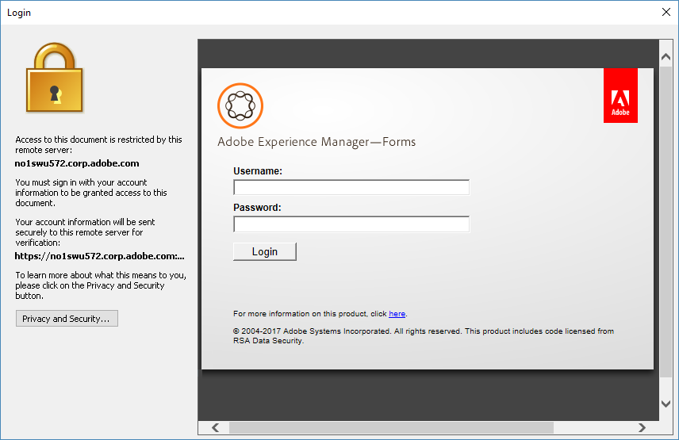

# Utilizzo di AEM Document Security Extension for Microsoft® Office{#using-aem-document-security-extension-for-microsoft-office}

## Proteggere i file con AEM Document Security Extension {#usingaemdocumentsecurityextensiontoprotectfiles}

È possibile controllare in che modo i destinatari utilizzano i file protetti da un criterio, indipendentemente dal numero di persone a cui sono stati distribuiti.

Con l’estensione Document Security Extension for Microsoft® Office è possibile effettuare le seguenti operazioni:

* Configurare la connessione a Document Security
* Applicare una policy a un file
* Aprire le pagine web di Document Security per creare e gestire le policy utente
* Rimuovere la protezione tramite policy da un file
* Modificare la policy applicata a un file
* Aprire le pagine web di Document Security per revocare l’accesso a un file o cambiare la policy applicata al file
* Aprire le pagine web di Document Security per visualizzare la cronologia di controllo di un file

### Connettersi a un server di Document Security {#connect-to-a-document-security-server}

Se desideri applicare un criterio a un file, devi prima configurare le impostazioni di connessione per Document Security. In base al modo in cui è stato installata l’estensione Document Security Extension for Microsoft® Office, è possibile che siano già attive le impostazioni di connessione predefinite. Puoi tuttavia aggiungere impostazioni di connessione per una o più istanze di Document Security e ottenere informazioni sul server dall’amministratore di Document Security.

Imposta il server che intendi utilizzare per proteggere i file o gestire i file protetti come server predefinito. Quando applichi un criterio a un nuovo file o apri le pagine web di Document Security, l’estensione Document Security Extension for Microsoft® Office si connette al server predefinito. Se proteggi i file utilizzando più di un’istanza di Document Security, devi modificare l’impostazione del server predefinito ogni volta che passi da un server all’altro. Potrai continuare ad aprire i file protetti da qualsiasi istanza di Document Security finché disporrai delle relative autorizzazioni di apertura.

Se il server di Document Security utilizza l’autenticazione basata su certificati, dovrai installare il certificato ricevuto nel computer locale. Ti verrà chiesto di scegliere l’autenticazione basata su certificati e di specificare il certificato da utilizzare per l’autenticazione.

Dopo aver configurato le impostazioni di connessione per un’istanza di Document Security in un’applicazione Microsoft® Office, questa viene configurata per Word, Excel e PowerPoint.

#### Installare il certificato lato client {#install-the-client-side-certificate}

Se devi accedere alle pagine web di Document Security tramite l’autenticazione basata su certificati o l’autenticazione a due fattori, riceverai il certificato da installare nel computer locale. Riceverai il file del certificato (.PFX o .P12) e la relativa password.

1. Salva il file del certificato nel computer locale.
1. Fai doppio clic sul file del certificato per aprire l’Importazione guidata certificati e fai clic su **Avanti**.
1. Se il file del certificato è elencato nella casella del nome file, fai clic su **Avanti**. Per selezionare un altro certificato, fai clic su **Sfoglia**.
1. Immetti la password ricevuta e fai clic su **Avanti**.
1. Nella finestra di dialogo Archivio certificati, seleziona Colloca tutti i certificati nel seguente archivio, quindi fai clic su **Sfoglia**.
1. Nella finestra di dialogo Seleziona archivio certificati, seleziona Personale, fai clic su **OK**, scegli **Avanti**, quindi fai clic su **Fine**.

#### Configurare le impostazioni di connessione {#configure-connection-settings}

1. Nell’estensione Document Security Extension for Microsoft® Office 2010 e Office 2013, nella scheda **Document Security**, seleziona **Scegli server**.
1. Fai clic su **Nuovo** per creare le impostazioni di connessione oppure seleziona una connessione esistente e fai clic su **Modifica**.
1. Digita un nome per la connessione nella casella **Nome**. Puoi specificare qualsiasi nome.
1. Digita l’indirizzo del server nella casella **Indirizzo server**.
1. Digita la porta del server nella casella **Porta**.
1. (Facoltativo) Se desideri che il nome utente e la password vengano ricordati, seleziona **Ricorda password su questo computer** e digita il nome utente e la password nelle caselle corrispondenti. Si consiglia di non selezionare questa opzione se altri utenti possono accedere al computer.
1. Fai clic su **Connetti a questo server**. L’estensione Document Security Extension for Microsoft® Office tenta di connettersi al server specificato. A seconda del tipo di autenticazione specificato, effettua una delle seguenti operazioni:

   **Nome utente e password**

   Immetti il nome utente e la password che hai ricevuto dall’amministratore di Document Security.

   **Autenticazione certificato**

   Scegli questa opzione per selezionare il certificato ricevuto e installato nell’archivio certificati personale.

   Se in Document Security è configurato un solo tipo di autenticazione, viene visualizzata solo questa opzione.

>[!NOTE]
>
>Se la connessione al server non riesce, prova ad aprire le pagine web di Document Security in Internet Explorer. Se la connessione al server tramite Internet Explorer non riesce o se una finestra di dialogo visualizza un avviso relativo al certificato del server, l’estensione Document Security Extension for Microsoft® Office non è in grado di connettersi al server. Contatta l’amministratore del server per richiedere assistenza.

>[!NOTE]
Se non è possibile eseguire la connessione a Document Security, viene visualizzato il seguente messaggio: “Nome utente e password non corretti. Controlla le impostazioni di configurazione e riprova”. È possibile infatti che questo messaggio venga visualizzato anche se la connessione ha esito negativo per altri motivi. Se ti stai connettendo al server per la prima volta, verifica di aver impostato correttamente il nome del server e la porta.

#### Specificare il server predefinito {#specify-the-default-server}

1. Effettua le seguenti operazioni:

   * Nell’estensione Document Security Extension per Microsoft® Office 2010 e Office 2013, nella scheda **Document Security**, seleziona **Scegli server**.

1. Seleziona un server da specificare come predefinito e fai clic su **Imposta come predefinito**. Accanto al server predefinito viene visualizzata una stella.

### Utilizzo di provider di autenticazione di terze parti {#using-third-party-authentication-providers}

Con AEM Forms Document Security è possibile utilizzare anche provider di autenticazione di terze parti. Tali provider di autenticazione consentono di aggiungere un ulteriore livello di accesso ai documenti protetti. AEM Forms Document Security supporta i seguenti flussi di lavoro di autenticazione estesa:

* Autenticazione estesa tramite l’URL predefinito di AEM Forms
* Autenticazione estesa tramite un URL personalizzato
* Flusso di lavoro di autenticazione estesa predefinito con provider di identità di terze parti configurati nel server AEM Forms su JEE
* Flusso di lavoro di autenticazione estesa personalizzato con provider di identità di terze parti configurati nel server AEM Forms su JEE
* Autenticazione estesa tramite una pagina personalizzata per l’elenco delle autenticazioni SAML

#### Autenticazione estesa tramite l’URL predefinito di AEM Forms {#extended-authentication-using-default-aem-forms-url}

Per l’autenticazione estesa è possibile utilizzare l’URL predefinito di AEM Forms. La pagina di destinazione predefinita contiene il branding Adobe. Se si utilizza l’URL predefinito di AEM Forms, inoltre, vengono applicate le impostazioni di AEM Forms predefinite.

Per abilitare l’autenticazione estesa con l’URL di destinazione Adobe predefinito, effettua le seguenti operazioni:

1. Apri l’interfaccia utente di amministrazione di AEM Forms.
1. Passa a Servizi > Document Security > Configurazione > Configurazione server.
1. Abilita l’opzione Consenti autenticazione estesa.
1. Specifica l’URL di destinazione per l’autenticazione estesa predefinito. L’URL predefinito è http://localhost:8080/edc/extendedauthentication/welcome.jsp.

   Fai clic su **[!UICONTROL Salva]**.

   >[!NOTE]
   Utilizza un nome host completo nell’URL. È consigliabile utilizzare il protocollo HTTPS.

   La funzione di protezione dei documenti di AEM Forms è ora configurata in modo da utilizzare l’autenticazione estesa con l’URL di destinazione di AEM Forms predefinito.

   

#### Autenticazione estesa con un URL di destinazione personalizzato {#extended-authentication-with-a-custom-landing-url}

Per l’autenticazione estesa puoi utilizzare un URL personalizzato, che offre la flessibilità necessaria per visualizzare una pagina di autenticazione personalizzata con un branding personalizzato, ad esempio il branding dell’organizzazione.

È possibile creare un pacchetto della pagina di autenticazione personalizzata in un file war e distribuire il file sul server di AEM Forms. Il file war contiene la logica completa per accettare le credenziali dell’utente e autenticarsi al server di AEM Forms. AEM Forms Document Security prevede i seguenti requisiti per la pagina di autenticazione personalizzata:

* La pagina di autenticazione deve inviare il nome utente come j_username e la password come j_password. La pagina deve inoltre inviare source_url e login_url come parametri nascosti.
* Se l’autenticazione ha esito positivo, la pagina deve chiudersi automaticamente.

Per abilitare l’autenticazione estesa con un URL di destinazione personalizzato:

1. Distribuisci il file war di autenticazione personalizzata al server di AEM Forms.
1. Apri l’interfaccia utente di amministrazione di AEM Forms.
1. Passa a Servizi > Document Security > Configurazione > Configurazione server.
1. Abilita l’opzione Consenti autenticazione estesa e specifica l’URL di destinazione per l’autenticazione estesa predefinito.
1. Al file config.xml sotto il nodo SSO dopo la voce *&lt;node name=&quot;AllowedUrls&quot;>*, aggiungi le seguenti voci:

   >[!NOTE]
   &lt;entry key=&quot;sso-l&quot; value=&quot;/ sample_/login.jsp&quot;/>!!discoiqbr!!&lt;entry key=&quot;sso-s&quot; value=&quot;/ sample_/welcome.jsp&quot;>!!discoiqbr!!&lt;entry key=&quot;sso-o&quot; value=&quot;/ sample_/logout.jsp&quot;/>!!discoiqbr!!

   Per informazioni dettagliate sull’aggiornamento del file config.xml, consulta [Modifica manuale del file di configurazione per la protezione dei documenti](https://helpx.adobe.com/it/aem-forms/6-3/admin-help/configuring-client-server-options.html#manually_editing_the_document_security_configuration_file).

   La funzione di protezione dei documenti di AEM Forms è ora configurata in modo da utilizzare l’autenticazione estesa con un URL di destinazione personalizzato.

#### Flusso di lavoro di autenticazione estesa predefinito con specificazioni di identità di terze parti configurate nel server di AEM Forms {#default-extended-authentication-workflow-with-third-party-identity-providers-configured-on-aem-forms-server}

L’autenticazione estesa può utilizzare i diversi tipi di autenticazione disponibili sul server di AEM Forms. Ad esempio SAML. [Altri esempi].

Nota: se nel server di AEM Forms sono configurate specificazioni SAML, prima di visualizzare l’URL di destinazione viene visualizzata una pagina contenente tutte le specificazioni di identità configurate per le autenticazioni SAML.

Quando un documento protetto viene aperto in Acrobat, viene visualizzata la schermata seguente.

#### Flusso di lavoro di autenticazione estesa personalizzato con specificazioni SAML configurate sul server di AEM Forms {#custom-extended-authentication-workflow-when-saml-providers-are-configured-on-aem-forms-server}

Se nel server di AEM Forms sono configurate specificazioni SAML, prima di visualizzare l’URL di destinazione viene visualizzata una pagina contenente tutte le specificazioni di identità configurate per le autenticazioni SAML.

I prerequisiti per configurare un flusso di lavoro di autenticazione estesa personalizzato, con specificazioni SAML configurate sul server di AEM Forms, sono:

* Sul server di AEM Forms devono essere configurate le autenticazioni SAML
* Sul server di AEM Forms deve essere distribuito il file war personalizzato, contenente una pagina di autenticazione personalizzata e la logica completa per accettare le credenziali dell’utente e autenticarsi al server di AEM Forms.

#### Utilizzo di una pagina personalizzata per l’elenco delle autenticazioni SAML {#using-custom-page-for-listing-saml-authentications}

Puoi anche scegliere di visualizzare una pagina personalizzata in cui includere tutte le specificazioni di autenticazione configurate sul server di AEM Forms. Per creare una pagina di questo tipo:

1. Crea un pacchetto della pagina di autenticazione personalizzata in un file WAR e distribuiscilo al server AEM Forms. Il file WAR contiene la logica completa per accettare le credenziali dell’utente e autenticarle per il server AEM Forms.
1. Apri l’interfaccia utente di amministrazione di AEM Forms e vai a **[!UICONTROL Impostazioni]** > **[!UICONTROL Gestione utente]** > **[!UICONTROL Configurazione]** > **[!UICONTROL Impostazioni provider di servizi SAML]**.
1. Aggiungi quanto segue al campo Proprietà personalizzate e fai clic su **[!UICONTROL Salva]**.

   *saml.sp.discovery.url=/demoJSP/saml_discovery.jsp*

   La funzione di protezione dei documenti di AEM Forms è ora configurata in modo da visualizzare una pagina personalizzata contenente tutti i provider di autenticazione configurati.

### Ottenere un account utente {#obtaining-a-user-account}

Se non disponi già di un account di Document Security, viene avviato il processo di registrazione quando si verifica uno di questi eventi:

* Un utente di Document Security che desidera inviarti un file protetto tramite policy ti aggiunge a una policy.
* L’amministratore di Document Security crea un account per te.

Dopo aver registrato e attivato l’account, puoi utilizzare i file protetti tramite policy per i quali hai ricevuto l’autorizzazione all’uso tramite una policy.

>[!NOTE]
Se ricevi un file protetto tramite policy ma non disponi di un account di Document Security o se ricevi un invito a registrarti, chiedi assistenza alla persona che ti ha inviato il file.

Se ricevi un invito da Document Security a registrarti tramite e-mail, puoi utilizzare l’URL contenuto nel messaggio e-mail per aprire la pagina di registrazione online. Dopo la registrazione, riceverai un secondo avviso sull’attivazione dell’account.

#### Ottenere un account utente esterno {#obtain-an-external-user-account}

1. Apri il messaggio di posta elettronica di registrazione a Document Security. L’URL contenuto nel messaggio contiene un collegamento alla pagina di registrazione per utenti esterni di Document Security. Se non ricevi un messaggio di registrazione, chiedi assistenza alla persona che ti ha inviato il file.
1. Fai clic sull’URL oppure copialo e incollalo nel browser.
1. Digita il tuo nome, la tua organizzazione e la tua password nelle caselle corrispondenti. La password può essere costituita da una qualsiasi combinazione di otto caratteri.

   >[!NOTE]
   Accertati di scegliere una password facile da ricordare; non è previsto alcun metodo per recuperare una password dimenticata.

1. Fai clic su **Registra**. Viene visualizzato un messaggio che ti invita a verificare nella posta se hai ricevuto un messaggio e-mail di attivazione.
1. Apri il messaggio di conferma della registrazione a Document Security.
1. Fai clic sull’URL che appare nel messaggio.
1. Fai clic sul collegamento alla pagina di accesso.
1. Nella casella **Nome utente** digita l’indirizzo e-mail con cui hai eseguito la registrazione a Document Security. Questo indirizzo e-mail costituirà il nome utente predefinito di Document Security.
1. Nella casella **Password**, digita la password creata al momento della registrazione.
1. Fai clic su **Accedi**.

### Creare e gestire le policy {#creating-and-managing-policies}

Se hai ricevuto l’apposita autorizzazione dall’amministratore di Document Security, puoi creare policy da applicare ai tuoi file nella pagina Policy della sezione web dedicata a Document Security.

Alcune delle impostazioni disponibili per la creazione di policy nelle pagine web di Document Security non sono supportate per i file Word, Excel e PowerPoint. Le tabelle seguenti descrivono le associazioni tra le autorizzazioni delle policy e le funzioni di Word, Excel e PowerPoint.

<table>
 <thead>
  <tr>
   <th>
Autorizzazioni
</th>
   <th>
Supporto per Word, Excel e PowerPoint
</th>
  </tr>
 </thead>
 <tbody>
  <tr>
   <td>
Stampa &gt; Non consentita
</td>
   <td>
La stampa del file non è consentita.
</td>
  </tr>
  <tr>
   <td>
Stampa &gt; Consentita
</td>
   <td>
La stampa del file è consentita.

<strong>Nota</strong>: <i>se una policy fornisce l’autorizzazione per la copia ma non per la stampa, è possibile stampare il contenuto copiato in un altro file.</i>
</td>
  </tr>
  <tr>
   <td>
Stampa &gt; Solo bassa risoluzione
</td>
   <td>
Non applicabile.
</td>
  </tr>
  <tr>
   <td>
Modifica &gt; Qualsiasi
</td>
   <td>
Il file può essere modificato.

Se questa autorizzazione non viene concessa, non è possibile modificare file Word ed Excel protetti. È possibile modificare file PowerPoint ma non salvare le modifiche o visualizzare presentazioni relative ai file modificati.
</td>
  </tr>
  <tr>
   <td>
Modifica &gt; Non consentita
</td>
   <td>
Gli utenti non possono modificare i file protetti.
</td>
  </tr>
  <tr>
   <td>
Modifica &gt; Modifica pagine
</td>
   <td>
Non applicabile.

Include l’inserimento, l’eliminazione e la rotazione delle pagine.
</td>
  </tr>
  <tr>
   <td>
Modifica &gt; Riempi e firma
</td>
   <td>
Non applicabile.
</td>
  </tr>
  <tr>
   <td>
Offline
</td>
   <td>
Il file può essere aperto offline.
</td>
  </tr>
  <tr>
   <td>
Copia
</td>
   <td>
Il contenuto del file può essere copiato in altri file.
</td>
  </tr>
  <tr>
   <td>
Utilità per la lettura dello schermo 
</td>
   <td>
Le utilità per la lettura dello schermo (dispositivi per utenti con problemi di vista) possono leggere il contenuto del file.
</td>
  </tr>
  <tr>
   <td>
Validità autorizzazione
</td>
   <td>
Supportata.
</td>
  </tr>
 </tbody>
</table>

<table>
 <thead>
  <tr>
   <th>
Impostazioni generali
</th>
   <th>
Supporto per Word, Excel e PowerPoint
</th>
  </tr>
 </thead>
 <tbody>
  <tr>
   <td>
Periodo di validità
</td>
   <td>
Supportato.
</td>
  </tr>
  <tr>
   <td>
Documento di controllo
</td>
   <td>
Supportato.
</td>
  </tr>
  <tr>
   <td>
Periodo di lease per attivazione automatica modalità offline
</td>
   <td>
Supportato.
</td>
  </tr>
  <tr>
   <td>
Provider di autorizzazioni esterni
</td>
   <td>
Supportato.
</td>
  </tr>
 </tbody>
</table>

<table>
 <thead>
  <tr>
   <th>
Impostazioni avanzate
</th>
   <th>
Supporto per Word, Excel e PowerPoint
</th>
  </tr>
 </thead>
 <tbody>
  <tr>
   <td>
Filigrane dinamiche
</td>
   <td>
Supportato.
</td>
  </tr>
  <tr>
   <td>
Plug-in di certificazione
</td>
   <td>
Non applicabile.
</td>
  </tr>
  <tr>
   <td>
Algoritmo di crittografia e lunghezza della chiave 
</td>
   <td>
Sono supportate tutte le opzioni.
</td>
  </tr>
  <tr>
   <td>
Limitazione documenti
</td>
   <td>
I contenuti di tutti i file vengono sempre crittografati, indipendentemente dall’impostazione della policy.
</td>
  </tr>
  <tr>
   <td>
Messaggio di errore di accesso negato
</td>
   <td>
Supportato.
</td>
  </tr>
 </tbody>
</table>

Per ulteriori informazioni sulla creazione e la gestione delle policy, consulta [Guida per l’utente finale di Document Security](https://help.adobe.com/it_IT/AEMForms/6.1/RMHelp/).

### Applicare le policy {#applying-policies}

Puoi applicare a un file qualsiasi policy disponibile, tra cui le policy create personalmente e quelle incluse in un set a cui hai accesso. Prima di applicare una policy, è tuttavia necessario salvare il file.

Dopo aver applicato una policy, questa viene aggiunta all’elenco Usate di recente accessibile dal menu di AEM Document Security per facilitarne l’applicazione. Se utilizzi più di un’istanza di Document Security, nell’elenco Usate di recente vengono visualizzate solo le policy relative al server a cui sei attualmente connesso o, se non hai ancora eseguito l’accesso ad alcuna istanza di Document Security, solo le policy relative al server predefinito.

>[!NOTE]
È possibile applicare criteri solo a file di documenti Word (.doc, .docx e .docm in Microsoft® Office 2010 e 2013), a file di cartelle di lavoro Excel (.xls, .xlsx e .xlsm in Microsoft® Office 2010 e 2013) e a file di presentazioni PowerPoint (.ppt, .pptx e .pptm in Microsoft® Office 2010 e 2013). Non è possibile applicarle invece a file di modelli Word (.dot), di modelli Excel (.xlt) e di modelli struttura PowerPoint (.pot).

#### Applicare una policy {#apply-a-policy}

1. In Document Security Extension for Microsoft® Office 2010 e 2013, nella scheda **Document Security**, seleziona **Proteggi > Scegli criterio**.

   Se scegli nome utente e password come metodo di autenticazione sul server e non hai ancora fornito le informazioni di accesso a Document Security, viene visualizzata una finestra di dialogo in cui devi immettere il nome utente e la password.

1. Seleziona una policy dall’elenco e fai clic su **Applica**.
1. Salva il file.

#### Applicare una policy usata di recente {#apply-a-recently-used-policy}

1. In Document Security Extension for Microsoft® Office 2010 e 2013, nella scheda **Document Security**, seleziona **Proteggi > ***[Nome criterio]*.
1. Salva il file.

## Utilizzare i file protetti tramite policy {#usingaemdocumentsecurityextensionpolicyprotectedfiles}

I file protetti tramite criterio contengono proprietà intellettuale di proprietà di chi ha pubblilcato il file e protetta tramite Document Security.

Puoi comunque utilizzare i file protetti tramite criteri indipendentemente dal fatto che tu sia interno o esterno all’organizzazione di cui fa parte chi ha pubblicato il file. Per aprire un file protetto tramite policy, devi essere riconosciuto da Document Security, sia tramite l’inclusione in un elenco LDAP o Active Directory collegato, a cui essere aggiunto come utente locale per LiveCycle o AEM Forms su JEE, sia mediante la registrazione in Document Security dopo essere stato invitato come utente.

Se ricevi un file protetto tramite policy ma non disponi di un account di Document Security o se ricevi un invito a registrarti, chiedi assistenza alla persona che ti ha inviato il file.

### Utilizzo di file protetti tramite criteri in Microsoft® Office {#working-with-policy-protected-files-in-microsoft-office}

Document Security Extension for Microsoft® Office limita alcune funzionalità di Word, Excel e PowerPoint per proteggere la proprietà intellettuale di chi pubblica il file. Se non disponi dell’autorizzazione necessaria per modificare il file, non puoi salvare eventuali modifiche apportate.

Se stai utilizzando un file protetto tramite policy, è possibile che alcune funzioni del prodotto non siano disponibili o non funzionino normalmente. Se inoltre hai un file non protetto aperto, la maggior parte delle funzioni è abilitata per il file non protetto, ad eccezione di quelle che consentono di importare o copiare contenuti da un file protetto tramite policy, se non disponi delle autorizzazioni per la copia o l’esportazione.

>[!NOTE]
Quando utilizzi applicazioni Office supportate da Document Security Extension, è consigliabile disabilitare la funzione Protezione esecuzione programmi di Windows. Inoltre, per garantire un avvio ottimale delle applicazioni Office nei computer in cui sono installati Document Security Extension e McAfee VirusScan con scansione all’accesso abilitata, disabilita l’opzione di protezione da overflow del buffer nella console di McAfee VirusScan.

Se una funzione non è disponibile, il nome di comando nel menu e il pulsante correlato sulla barra degli strumenti non sono disponibili. In Document Security Extension for Microsoft® Office, quando passi il puntatore del mouse su un comando o un pulsante, una descrizione del comando indica che Document Security ha reso il comando non disponibile.

### Apertura di file protetti tramite policy {#opening-policy-protected-files}

Puoi aprire un file protetto tramite policy con gli stessi metodi utilizzati per aprire qualsiasi altro file. Se non hai ancora eseguito l’accesso a Document Security, ti verrà richiesto di accedere, a meno che tu sia scollegato da Internet e possa aprire il file offline. Se annulli la procedura di accesso, l’accesso viene negato.

Se non disponi dell’autorizzazione necessaria per aprire il file, verrai avvisato che l’accesso è stato negato. Se i privilegi di accesso al file sono stati revocati, potresti essere reindirizzato a una versione aggiornata del file, se disponibile. Se non riesci ad aprire un file protetto tramite policy, contatta l’autore del file per ricevere assistenza.

Quando viene aperto un file protetto, il testo che segue il nome del file nella barra del titolo informa che il file è protetto tramite AEM Document Security.

Quando apri un documento protetto in Document Security Extension for Microsoft® Office da un server SharePoint, accertati che sia aperto il programma Microsoft® Office associato al tipo di file, ad esempio Microsoft® Word, Microsoft® Excel o Microsoft® PowerPoint. Se provi ad aprire il file senza prima aver aperto l’applicazione associata, è possibile che il documento non si apra e che venga visualizzato un messaggio di errore in cui si informa che è necessario installare il plug-in appropriato. Prima di aprire un documento protetto in Document Security Extension for Microsoft® Office da un server SharePoint, oltre ad aprire l’applicazione necessaria, è opportuno svuotare la cartella della cache. Quando apri un documento protetto da SharePoint Server, vengono inoltre disattivate tutte le autorizzazioni sul documento, indipendentemente dalle policy applicate.

A seconda del metodo di autenticazione implementato in Document Security, è possibile che, all’apertura di un documento protetto, venga richiesto di scegliere il metodo di autenticazione desiderato. Se Document Security supporta più di un metodo di autenticazione, vengono visualizzate tutte le opzioni di autenticazione disponibili. Se, ad esempio, il server di Document Security prevede l’autenticazione sia tramite nome utente/password sia tramite certificato, puoi scegliere il metodo di autenticazione appropriato. Se è abilitata l’autenticazione basata su certificati, ti viene richiesto di utilizzare il certificato ricevuto e installato.

L’esperienza utente all’apertura di un file protetto dipende dalla configurazione dell’autenticazione reciprocamente impostata sul server. Se è installato un solo certificato client valido, non viene visualizzata alcuna finestra di dialogo di autenticazione e il file si apre correttamente. Se, invece, in un computer sono installati più certificati client, viene visualizzata una finestra di dialogo di autenticazione e, per poter aprire il file protetto, l’utente deve scegliere un certificato valido.

### Rimozione della protezione tramite policy da un file {#removing-policy-protection-from-a-file}

Puoi rimuovere la protezione tramite policy da un file protetto solo se disponi della necessaria autorizzazione. In questo modo, il file non risulterà più protetto tramite Document Security.

1. In Document Security Extension for Microsoft® Office 2010 e 2013, nella scheda **Document Security**, seleziona **Rimuovi**.

   Se non hai ancora fornito le informazioni di accesso a Document Security, viene visualizzata una finestra di dialogo in cui devi immettere il nome utente e la password.

>[!NOTE]
Se non riesci a rimuovere una policy da un file che hai protetto, contatta un amministratore di Document Security.

### Visualizzazione delle impostazioni di protezione {#viewing-security-settings}

Puoi visualizzare le autorizzazioni di cui disponi per il file corrente a livello di stampa, copia, modifica e accesso offline, oltre al periodo di validità del file.

In Document Security Extension for Microsoft® Office 2010, le autorizzazioni per il file vengono visualizzate nel gruppo Stato protezione nella scheda Document Security.

Effettua le seguenti operazioni:

* In Document Security Extension for Microsoft® Office 2010 e 2013, nella **scheda Document Security** fai clic su una voce qualsiasi nel gruppo **Stato protezione**.

### Salvataggio dei documenti quando è abilitata l’applicazione automatica del criterio {#saving-documents-when-auto-apply-policy-is-enabled}

Se l’amministratore ha abilitato la funzione di applicazione automatica del criterio, tutti i documenti creati o modificati verranno automaticamente protetti quando il documento viene salvato.

Se la funzione di applicazione automatica del criterio è abilitata, Document Security Extension for Microsoft® Office ti richiederà di accedere al server Document Security. Dovrai specificare il nome utente e la password per essere autenticato dal server. Se avrai specificato le credenziali di accesso corrette, il documento verrà salvato e protetto.

>[!NOTE]
Se invece non riesci ad accedere a Document Security, è possibile che il documento non venga salvato. Questo dipende dal modo in cui l’amministratore ha configurato la funzione di applicazione automatica della policy. Rivolgiti all’amministratore per sapere come vengono gestiti i documenti in questa situazione.

### Sincronizzazione per l’accesso offline {#synchronizing-for-offline-access}

Con le policy potrai aprire i file anche mentre sei offline e non connesso a Document Security. Prima di poter lavorare offline, tuttavia, dovrai aver precedentemente eseguito l’accesso a Document Security per memorizzare le credenziali nel server. Se prevedi di utilizzare i file in modalità offline, prima di disconnetterti effettua la sincronizzazione con Document Security in modo da assicurarti che le impostazioni della policy associata ai file siano aggiornate con il server. È inoltre consigliabile aprire il file una volta online prima di aprirlo offline. In alcuni casi, è comunque possibile utilizzare un file protetto tramite policy in modalità offline anche se non il file non è stato aperto almeno una volta online o se non è stata effettuata la sincronizzazione con il server. È tuttavia necessario che il periodo di lease per l’attivazione della modalità offline non sia scaduto e che le impostazioni della policy relative al file non siano state modificate dall’ultima sincronizzazione manuale o automatica con il server.

Effettua le seguenti operazioni:

* In Document Security Extension for Microsoft® Office 2010 e 2013, nella scheda **Document Security**, seleziona **Sincronizza offline**.

   ***Nota**: il pulsante di sincronizzazione offline è disponibile anche se l’utente non dispone di autorizzazioni offline sul documento. Se si seleziona il pulsante, tuttavia, non viene eseguita alcuna operazione. *

### Utilizzo delle filigrane dinamiche {#working-with-dynamic-watermarks}

Document Security Extension for Microsoft® Office supporta l’inserimento di filigrane dinamiche basate su testo nei documenti protetti tramite criterio. Una filigrana dinamica può includere informazioni che possono essere modificate, come la data, l’ora, il nome utente o il nome della policy. Se un utente stampa un file protetto tramite policy e il file contiene una filigrana dinamica e l’autorizzazione di stampa, la filigrana viene visualizzata nell’output.

Document Security Extension non supporta funzionalità avanzate per le filigrane, ad esempio filigrane basate su PDF, filigrane con più elementi, opzioni di formattazione del testo e intervalli di pagine.

Puoi creare una filigrana dinamica utilizzando le pagine web di Document Security. Per ulteriori informazioni sulla creazione e l’inserimento di filigrane dinamiche in un documento protetto tramite policy, consulta [Guida per l’utente finale di Document Security](https://www.adobe.com/go/learn_lc_euRightsMgmt_11_it).

Document Security Extension for Microsoft® Office supporta le seguenti funzionalità per filigrane:

<table>
 <thead>
  <tr>
   <th>
Opzioni delle filigrane di Document Security
</th>
   <th>
Supporto per Word, Excel e PowerPoint
</th>
  </tr>
 </thead>
 <tbody>
  <tr>
   <td>
Nome policy
</td>
   <td>
Supportato.
</td>
  </tr>
  <tr>
   <td>
Nome filigrana
</td>
   <td>
Supportato.
</td>
  </tr>
  <tr>
   <td>
Usa come sfondo
</td>
   <td>
Anche se viene selezionata questa opzione, il comportamento di visualizzazione di una filigrana dinamica non cambia.

In Word 2010 e 2013 la filigrana dinamica è visibile solo nelle visualizzazioni Layout di stampa e Anteprima di stampa, 

così come in Excel 2010 e 2013, in cui è visibile nelle visualizzazioni Anteprima di stampa e Layout di pagina.
</td>
  </tr>
  <tr>
   <td>
Posizione verticale
</td>
   <td>
Supportata
</td>
  </tr>
  <tr>
   <td>
Posizione orizzontale
</td>
   <td>
Supportata

In Excel 2010 e 2013 la disposizione orizzontale delle filigrane tramite l’utilizzo di punti non è supportata.
</td>
  </tr>
  <tr>
   <td>
Scala
</td>
   <td>
Supportato
</td>
  </tr>
  <tr>
   <td>
Posizione
</td>
   <td>
Supportato
</td>
  </tr>
  <tr>
   <td>
Opacità
</td>
   <td>
Supportato
</td>
  </tr>
 </tbody>
</table>

### Apertura delle pagine web di Document Security {#opening-the-document-security-web-pages}

Nelle pagine web di Document Security potrai creare e aggiornare le policy utente e visualizzare lo stato e le informazioni di controllo relative ai file protetti tramite policy. Potrai utilizzare le pagine web di Document Security anche per modificare le policy o revocare l’accesso a un file protetto tramite policy.

Per aprire le pagine web di Document Security, in Document Security Extension for Microsoft® Office 2010 e 2013, nella scheda **Document Security**, seleziona **Crea &amp; gestisci criteri**. Se non hai ancora fornito i dati di accesso, il browser apre automaticamente la pagina di accesso al server.

### Modifica delle policy {#changing-policies}

Se disponi delle autorizzazioni di amministratore di Document Security o di autore di file, in un secondo momento puoi applicare un’altra policy a un file o modificare le impostazioni della policy attualmente applicata.

Per modificare le impostazioni di una policy, potrai utilizzare le pagine web di Document Security.

1. Effettua le seguenti operazioni:

   * In Document Security Extension for Microsoft® Office 2010 o 2013, nella scheda **Document Security**, seleziona **Proteggi > Modifica protezione**.

1. Seleziona un criterio dall’elenco e fai clic su **Applica**.

### Revoca dei privilegi di accesso ai file {#revoking-file-access-privileges}

È possibile revocare la facoltà di aprire i file precedentemente protetti. Quando esegui la procedura di revoca dei privilegi di accesso a un file, puoi anche specificare il messaggio che verrà visualizzato a chiunque tenti di aprire il file e l’URL della versione aggiornata del file, se è stato sostituito con una copia rivista.

1. Effettua le seguenti operazioni:

   * In Document Security Extension for Microsoft® Office 2010 e 2013, nella scheda **Document Security**, seleziona **Revoca**.

   Le pagine web di Document Security si aprono automaticamente sulla pagina Revoca documenti.

1. Specifica un messaggio da visualizzare e, se disponibile, l’URL della versione aggiornata, quindi fai clic su **OK**.

Per ulteriori informazioni sulla revoca dei privilegi di accesso ai file, consulta [Guida per l’utente finale di Document Security](https://help.adobe.com/it_IT/AEMForms/6.1/RMHelp/).

I privilegi di accesso possono essere ripristinati tramite le pagine web di Document Security.

### Visualizzazione della cronologia di controllo dei file {#viewing-the-file-audit-history}

Document Security consente di salvare la cronologia di controllo dei file protetti tramite policy per controllare le azioni eseguite dagli utenti sui file.

Nei file Word, Excel e PowerPoint vengono controllati gli eventi seguenti:

**Protezione di un nuovo documento** Policy applicata a un file

**Visualizzazione di un documento** File aperto

**Chiusura di un documento** File chiuso

**Revoca di un documento** Privilegi di accesso rimossi per il file

**Annullamento della revoca di un documento** Privilegi di accesso ripristinati sul file

**Modifica di un documento** File modificato e salvato localmente

**Stampa ad alta risoluzione** File stampato

**Modifica del gestore di protezione** Protezione della policy rimossa dal file

**Cambio della policy applicata al documento** Nuova policy applicata al file dalle pagine web di Document Security

### Visualizzare la cronologia dei controlli di un file {#view-the-audit-history-for-a-file}

In Document Security Extension for Microsoft® Office 2010 e 2013, nella scheda **Document Security**, seleziona **Cronologia controlli**.

Le pagine web di Document Security si aprono automaticamente sulla pagina Eventi, in cui vengono visualizzati gli eventi controllati relativi al file corrente.

### Funzioni limitate di Microsoft® Office {#microsoft-office-restricted-features}

Per proteggere la proprietà intellettuale, quando si apre un file protetto tramite criterio alcune funzioni di Microsoft® Office risultano non disponibili. L’elenco delle funzioni non disponibili dipende dalle autorizzazioni concesse all’utente corrente. All’interno di una sessione protetta, alcune funzioni risultano non disponibili solo per un file protetto, mentre altre per tutti i file. In genere, una sessione protetta inizia nel momento in cui viene aperto un file protetto tramite policy e termina con la chiusura dell’applicazione o con la scadenza della sessione.

La maggior parte delle policy prevede la concessione di autorizzazioni complete agli autori dei file, mentre per gli altri utenti possono essere applicate funzioni limitate.

Se un comando non è disponibile, il nome del comando nel menu e il pulsante correlato sulla barra degli strumenti sono disattivati.

>[!NOTE]
L’applicazione di una policy a un file contenente un collegamento a un file incorporato non determina l’applicazione della policy al file collegato. Document Security for Microsoft® Office non estende infatti la protezione ai file collegati.

* I file Word, Excel e PowerPoint protetti tramite policy non possono essere aperti in una finestra del browser Internet Explorer.
* Gli utenti ai quali è stata concessa solo l’autorizzazione di modifica non possono copiare in un file contenuti provenienti da un’altra applicazione utilizzando la funzione Appunti di Windows. Gli utenti possono tuttavia copiare contenuti nei file abilitando l’opzione Appunti di Microsoft® Office.
* Quando si apre un file protetto tramite criterio in Microsoft® Office, il tasto Stampa schermo non risulta più disponibile finché non viene chiusa l’applicazione o non scade la sessione.
* Document Security for Microsoft® Office non supporta il Web-based Distributed Authoring and Versioning (WebDAV). Solitamente, quindi, non è possibile aprire un file protetto tramite criterio da una cartella WebDAV. Nei casi in cui è possibile aprire il file, non si disporrà comunque delle autorizzazioni necessarie per salvare, stampare o modificare il file o copiarne i contenuti.

La protezione generale applicata ai file protetti tramite criterio prevede le seguenti limitazioni:

Molte funzioni comuni possono risultare limitate in Word, Excel e PowerPoint durante una sessione protetta.

Se viene aperto un file protetto tramite un criterio che non autorizza l’utente ad apportare modifiche, i comandi che consentono di modificare il file in qualsiasi modo non risultano disponibili. Restano disponibili soltanto i comandi che consentono di aprire o creare documenti o di modificare le preferenze dell’applicazione.

#### Limitazioni per Word 2010 e Word 2013 {#word-2010-and-word-2013-restrictions}

Con l’apertura di un file protetto tramite policy in Word, il salvataggio delle informazioni di recupero automatico dei file risulta non disponibile fino a quando non si chiude e si riavvia Word. Le funzioni elencate di seguito, inoltre, risultano limitate nelle situazioni descritte:

**File > Nuovo > Nuovo da esistente** Disponibile, ma i file creati utilizzando questo comando mentre è aperto un file protetto tramite policy non possono essere salvati. Il contenuto del nuovo file, inoltre, non può essere copiato in un altro file.

**File > Salva** Soggetta ai limiti dell’autorizzazione di modifica.

**File > Salva con nome** Tutte le opzioni sono soggette ai limiti dell’autorizzazione di modifica.

**File > Stampa** Tutte le opzioni sono soggette ai limiti dell’autorizzazione di stampa. Disponibile solo se la policy consente la stampa ad alta risoluzione.

**File > Salva e invia** Nessuna delle opzioni è disponibile durante una sessione protetta.

**File > Info > Proteggi documento > Crittografa con password, Aggiungi firma digitale, Segna come finale, Limita le autorizzazioni per gli utenti** Non disponibili durante una sessione protetta.

**File > Flussi di lavoro** Non disponibile durante una sessione protetta.

***Nota **: la capacità di avviare un flusso di lavoro dalle versioni di Word, Excel e PowerPoint di Microsoft® Office 2010 è disponibile solo nelle suite Office Professional Plus 2010, Office Enterprise 2010 e Office Ultimate 2010, nonché nelle versioni autonome di questi programmi nell’ambito di Office 2010.*

**Post di blog > Pubblica** Non disponibile durante una sessione protetta.

**File > Server > Menu Attività file server** Non disponibile durante una sessione protetta.

**Home > Appunti > Copia** Soggetta ai limiti dell’autorizzazione di copia. Se la copia non è consentita, il contenuto copiato non può essere incollato in nessun altro file né negli Appunti di Office. Il contenuto può essere tuttavia copiato all’interno del file protetto se l’utente dispone dell’autorizzazione di modifica.

**Home > Appunti > Incolla** Soggetta ai limiti dell’autorizzazione di modifica.

**Home > Appunti > Incolla speciale** Soggetta ai limiti dell’autorizzazione di modifica.

**Inserisci > Testo > Oggetto** Non disponibile durante una sessione protetta. I file protetti tramite policy non possono essere inseriti in alcun momento.

**Lettere** La maggior parte delle opzioni presenti in questa scheda non è disponibile durante una sessione protetta.

**Revisione > Strumenti di correzione > Ricerche** Soggetta ai limiti dell’autorizzazione di copia. Non disponibile se la copia non è consentita.

**Revisione > Strumenti di correzione > Thesaurus** Soggetta ai limiti dell’autorizzazione di copia. Non disponibile se la copia non è consentita.

**Revisione > Lingua > Traduci > Traduci documento** Abilitata con l’autorizzazione di copia.

**Revisione > Lingua > Traduci > Traduci testo selezionato** Abilitata con l’autorizzazione di copia.

**Revisione > Lingua > Traduci > Mini-traduttore** Abilitata con l’autorizzazione di copia.

**Revisione > Confronta > Confronta** Non disponibile durante una sessione protetta. Non è mai possibile eseguire il confronto di file protetti tramite policy.

**Revisione > Proteggi > Blocca autori** Non disponibile durante una sessione protetta.

**Revisione > Proteggi > Limita modifica** Non disponibile durante una sessione protetta.

**Visualizza > Macro** Alcune macro sono soggette ai limiti dell’autorizzazione di copia e non sono disponibili se non è consentita la copia.

**Componenti aggiuntivi** Non possono essere aggiunti o rimossi durante una sessione protetta.

**Collaborazione online** Non disponibile durante una sessione protetta.

**Documento master e documenti secondari** I documenti secondari sono disciplinati dalla policy applicata ai documenti master quando vengono aperti all’interno del documento master. Se invece vengono aperti separatamente, i documenti secondari non possono essere stampati, copiati né modificati.

**Ripeti sunto** Non disponibile durante una sessione protetta.

**Frame (e tutti i comandi correlati)** Non disponibili durante una sessione protetta.

**Riquadro documenti** Non disponibile durante una sessione protetta.

**Sviluppatore > Modello documento** Non disponibile durante una sessione protetta. Per accedere a questo comando, seleziona File > Opzioni > Personalizza > Scheda Sviluppo > Modelli > Modello documento.

**Struttura > Documento master > Crea documento secondario, Inserisci documento secondario** Non disponibile durante una sessione protetta.

#### Limitazioni per Excel 2010 ed Excel 2013 {#excel-2010-and-excel-2013-restrictions}

Le funzioni elencate di seguito risultano limitate nelle situazioni descritte:

**File > Nuovo > Nuovo da esistente** Disponibile, ma i file creati con questo comando durante una sessione protetta non possono essere salvati. Il contenuto del nuovo file, inoltre, non può essere copiato in un altro file.

**File > Salva, Salva con nome** Soggetta ai limiti dell’autorizzazione di modifica.

**File > Salva con nome > PDF** Non disponibile durante una sessione protetta.

**File > Stampa** Soggetta ai limiti dell’autorizzazione di stampa. Disponibile solo se la policy consente la stampa ad alta risoluzione.

**File > Informazioni > Proteggi documento** Non disponibile durante una sessione protetta.

**File > Informazioni > Proteggi cartella di lavoro** Non disponibile durante una sessione protetta.

**File > Salva e invia** Non disponibile durante una sessione protetta.

**File > Opzioni > Componenti aggiuntivi** Non possono essere aggiunti o rimossi durante una sessione protetta.

**File > Flussi di lavoro** Non disponibile durante una sessione protetta.

***Nota **: la capacità di avviare un flusso di lavoro dalle versioni di Word, Excel e PowerPoint di Microsoft® Office 2010 è disponibile solo nelle suite Office Professional Plus 2010, Office Enterprise 2010 e Office Ultimate 2010, nonché nelle versioni autonome di questi programmi nell’ambito di Office 2010.*

**File > Server > Menu Attività file server** Non disponibile durante una sessione protetta.

**Home > Appunti > Copia** Soggetta ai limiti dell’autorizzazione di copia. Se la copia non è consentita, il contenuto copiato non può essere incollato in nessun altro file né negli Appunti di Microsoft® Office. Il contenuto può essere tuttavia copiato all’interno del file protetto se l’utente dispone dell’autorizzazione di modifica.

**Home > Appunti > Incolla** Soggetta ai limiti dell’autorizzazione di modifica.

**Home > Appunti > Incolla speciale** Soggetta ai limiti dell’autorizzazione di modifica.

**Home > Celle > Formato > Sposta o copia foglio** Non disponibile durante una sessione protetta.

**Home > Celle > Inserisci > Inserisci foglio** Non disponibile durante una sessione protetta.

**Home > Celle > Elimina > Elimina foglio** Non disponibile durante una sessione protetta.

**Home > Modifica > Riempimento > Tra fogli di lavoro** Soggetta ai limiti dell’autorizzazione di modifica.

**Inserisci > Tabelle > Tabella** Soggetta ai limiti dell’autorizzazione di modifica.

**Inserisci > Tabelle > Tabella pivot** I file protetti tramite policy non possono essere selezionati nella creazione guidata.

**Inserisci > Testo > Oggetto** Non disponibile durante una sessione protetta. I file protetti tramite policy non possono essere inseriti in alcun momento.

**Inserisci > Testo > Intestazione e piè di pagina** Soggetta ai limiti dell’autorizzazione di modifica. Non disponibile per un documento protetto tramite policy.

**Dati > Recupera dati esterni** Non è possibile importare dati da file protetti tramite policy.

**Dati > Struttura > Subtotali** Soggetta ai limiti dell’autorizzazione di modifica.

**Dati > Strumenti dati > Convalida dati** Soggetta ai limiti dell’autorizzazione di modifica.

**Revisione > Strumenti di correzione > Ricerche** Soggetta ai limiti dell’autorizzazione di copia.

**Revisione > Strumenti di correzione > Thesaurus** Soggetta ai limiti dell’autorizzazione di copia.

**Revisione > Lingua > Traduci** Soggetta ai limiti dell’autorizzazione di copia.

**Revisione > Modifiche > Proteggi foglio** Non disponibile durante una sessione protetta.

**Revisione > Modifiche > Proteggi cartella di lavoro** Non disponibile durante una sessione protetta.

**Revisione > Modifiche > Condividi cartella di lavoro** Non disponibile durante una sessione protetta.

**Revisione > Modifiche > Proteggi e condividi cartella di lavoro** Non disponibile durante una sessione protetta.

**Revisione > Modifiche > Consenti agli utenti la modifica degli intervalli** Non disponibile durante una sessione protetta.

**Revisione > Modifiche > Rileva modifiche > Evidenzia modifiche** Non disponibile per un file protetto tramite policy contenente una filigrana dinamica.

**Visualizza > Macro** Soggetta ai limiti dell’autorizzazione di modifica.

**Visualizza > Salva area di lavoro** Questo comando non funziona.

**Sviluppo > XML > Pacchetti di espansione** Alcune macro sono soggette ai limiti dell’autorizzazione di copia e non sono disponibili se non è consentita la copia.

**Formule > Verifica formule > Controllo errori** Soggetta ai limiti dell’autorizzazione di modifica. Disponibile solo se è consentita la modifica.

**Collaborazione online** Non disponibile durante una sessione protetta.

**Salva informazioni di salvataggio automatico** Non disponibile durante una sessione protetta.

***Nota **: se si tenta di modificare una cella in un file protetto tramite policy per il quale non si dispone delle autorizzazioni di modifica, Excel visualizza un messaggio di avviso non corretto in cui si specifica che è necessario rimuovere la protezione dal file utilizzando il comando Rimuovi protezione foglio. L’utilizzo del comando Rimuovi protezione foglio non rimuove la protezione tramite policy dal file.*

#### Limitazioni per PowerPoint 2010 e PowerPoint 2013 {#powerpoint-2010-and-powerpoint-2013-restrictions}

Le funzioni elencate di seguito risultano limitate nelle situazioni descritte:

**File > Nuovo > Nuovo da esistente** Disponibile, ma i file creati con questo comando durante una sessione protetta non possono essere salvati. Il contenuto del nuovo file, inoltre, non può essere copiato in un altro file.

**File > Salva** Soggetta ai limiti dell’autorizzazione di modifica.

**File > Salva con nome** Tutte le opzioni sono soggette ai limiti dell’autorizzazione di modifica.

**File > Stampa** Tutte le opzioni sono soggette ai limiti dell’autorizzazione di stampa. Disponibile solo se la policy consente la stampa ad alta risoluzione.

**File > Salva e invia** Non disponibile durante una sessione protetta.

**File > Info > Proteggi presentazione > Crittografa con password, Aggiungi firma digitale, Segna come finale, Limita le autorizzazioni per gli utenti** Non disponibili durante una sessione protetta.

**File > Opzioni di PowerPoint > Salva informazioni di salvataggio automatico** Non disponibile durante una sessione protetta.

**File > Server > Menu Attività file server** Non disponibile durante una sessione protetta.

**Home > Appunti > Copia** Soggetta ai limiti dell’autorizzazione di copia. Se la copia non è consentita, il contenuto copiato non può essere incollato nello stesso documento, né in altri file o negli Appunti di Office. Il contenuto può essere tuttavia copiato all’interno del file protetto se l’utente dispone dell’autorizzazione di modifica.

**Home > Appunti > Incolla** Soggetta ai limiti dell’autorizzazione di modifica. Se la copia non è consentita, il contenuto copiato non può essere incollato nel documento.

**Home > Appunti > Incolla speciale** Soggetta ai limiti dell’autorizzazione di modifica.

**Home > Diapositive > Nuove diapositive > Diapositive dalla struttura, Riutilizza diapositive** Non disponibile durante una sessione protetta.

**Inserisci > Testo > Oggetto** Non disponibile durante una sessione protetta. I file protetti tramite policy non possono essere inseriti in alcun momento.

**Progettazione > Sfondo > Stili di sfondo, Nascondi grafica di sfondo, Formato sfondo** Non disponibile per un file protetto tramite policy contenente una filigrana dinamica.

**Presentazione > Imposta > Registra presentazione** Soggetta ai limiti dell’autorizzazione di modifica.

**Revisione > Strumenti di correzione > Thesaurus** Soggetta ai limiti dell’autorizzazione di copia.

**Revisione > Lingua > Traduci** Soggetta ai limiti dell’autorizzazione di copia.

**Revisione > Lingua > Traduci > Mini-traduttore** Abilitata con l’autorizzazione di copia.

**Visualizza > Visualizzazioni presentazione > Presentazione** Soggetta ai limiti dell’autorizzazione di modifica. Se non sono consentite modifiche, non è possibile visualizzare una presentazione nel caso in cui il file sia stato modificato.

**Visualizza > Macro** Alcune macro sono soggette ai limiti dell’autorizzazione di copia e non sono disponibili se non è consentita la copia.

**Componenti aggiuntivi** Non possono essere aggiunti o rimossi durante una sessione protetta.

**Collaborazione online** Non disponibile durante una sessione protetta.

## Utilizzo di provider di autenticazione di terze parti {#use-third-party-authentication-providers}

Con AEM Forms Document Security è possibile utilizzare anche provider di autenticazione di terze parti. Tali provider di autenticazione consentono di aggiungere un ulteriore livello di accesso ai documenti protetti. AEM Forms Document Security supporta i seguenti flussi di lavoro di autenticazione estesa:

* Autenticazione estesa tramite l’URL predefinito di AEM Forms
* Autenticazione estesa tramite un URL personalizzato
* Flusso di lavoro di autenticazione estesa predefinito con provider di identità di terze parti configurati nel server AEM Forms su JEE
* Flusso di lavoro di autenticazione estesa personalizzato con provider di identità di terze parti configurati nel server AEM Forms su JEE
* Autenticazione estesa tramite una pagina personalizzata per l’elenco delle autenticazioni SAML

## Glossario {#glossary}

Per informazioni su LiveCycle, AEM Forms e sulla terminologia JEE, consulta il [Capitolo 19: glossario](https://www.adobe.com/go/learn_aemforms_designer_65_it).
